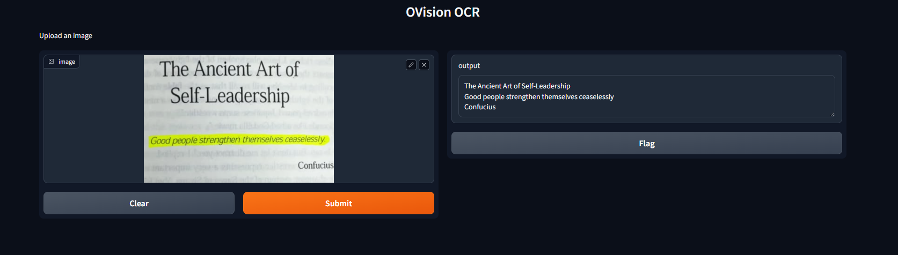
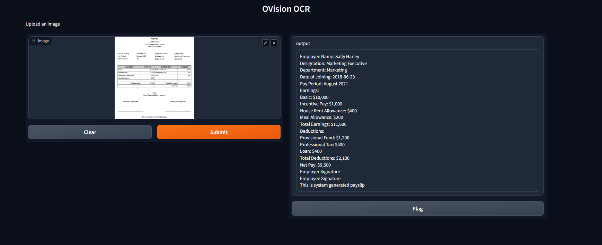

# OVision OCR
### Overview
The OVision OCR application is a Gradio-based tool that extracts all data from  images documents using the Qwen2-VL-2B-OCR model. This solution leverages advanced image-text processing capabilities from the Hugging Face Transformers library.

### Features
- Extracts textual information from images without missing any details.
- Uses a cutting-edge Qwen2-VL-2B-OCR model for OCR and contextual understanding.
- Provides a user-friendly interface for uploading images and retrieving text data.

### Requirements
#### Dependencies
- Python 3.8+
- Required Python Libraries:
  - transformers
  - torch
  - torchvision
  - Pillow
  - gradio

Install dependencies using
```
pip install transformers torch torchvision Pillow gradio
```

#### Hardware
- A CUDA-enabled GPU is required for efficient processing.

## 📥Installation
1. Clone or download the repository:
```
git clone https://github.com/your-repo/ovision-ocr.git
cd ovision-ocr
```
2. Install dependencies:
```
uv sync
```
3. Verify that a CUDA-enabled device is available.

#### How to Use
1. Launch the Application: Run the script in your terminal:
```
uv run app.py
```
```
gradio app.py
```
2. Interact with the Interface:
- Open the Gradio interface in your web browser (URL provided in the terminal).
- Upload an image (preferably a payslip or document containing text).
- The application will extract and display all text information from the uploaded image.
3. End the Application: Stop the process by closing the terminal or the Gradio interface.

# Result

## Code Explanation
#### Core Components
- Pretrained Models:
  - JackChew/Qwen2-VL-2B-OCR: Pretrained model for OCR and text-to-text generation.
- Processor and Model:
  - AutoProcessor for text-image preprocessing.
  - AutoModelForImageTextToText for inference.
- Inference:
  - The function OCR(image: Image.Image) processes the uploaded image and generates extracted text using the pretrained model.
- Gradio Interface:
  - The Gradio interface accepts an image as input and displays extracted text as output.

#### Input and Output
- Input:
  - An image file uploaded by the user (e.g., a PNG or JPG).
- Output:
  - Extracted textual content from the image.

## Workflow
1. Preprocess the uploaded image and generate the text prompt using AutoProcessor.
2. Send the image and text to the model for inference.
3. Decode the generated output text and return it.
#### Example
Run the application, upload a payslip image, and the output will look something like:
```
Employee Name: John Doe
Employee ID: 123456
Net Pay: $3,200
Pay Period: Dec 2024
```


## 🤝 Contributing
We welcome contributions from the community! To contribute:
1. Fork the repository.
2. Create a feature branch: git checkout -b feature-name.
3. Commit your changes: git commit -m 'Add some feature'.
4. Push to the branch: git push origin feature-name.
5. Create a pull request.

### License
This project is licensed under the MIT License. See the LICENSE file for details..

Feel free to contribute by submitting issues or pull requests. Happy OCR-ing! 🚀

Made with ❤️ by [Prakhar Awasthi](ttps://github.com/prakhar105)
